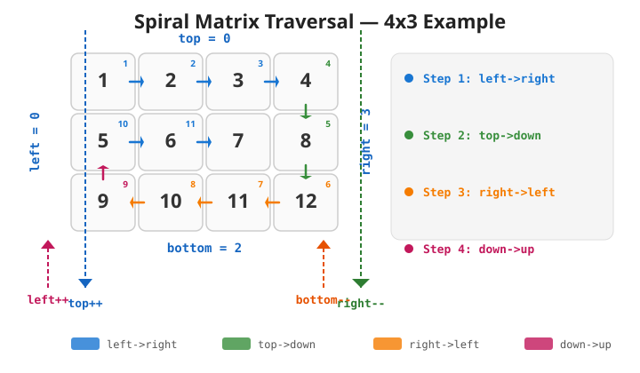

# 35. 螺旋矩阵

## 题目描述

给你一个 `m` 行 `n` 列的矩阵 `matrix`，请按照 **顺时针螺旋顺序**，返回矩阵中的所有元素。

**示例 1：**

```
输入：matrix = [[1,2,3],[4,5,6],[7,8,9]]
输出：[1,2,3,6,9,8,7,4,5]
```

**示例 2：**

```
输入：matrix = [[1,2,3,4],[5,6,7,8],[9,10,11,12]]
输出：[1,2,3,4,8,12,11,10,9,5,6,7]
```

**约束条件：**

- `m == matrix.length`
- `n == matrix[i].length`
- `1 <= m, n <= 10`
- `-100 <= matrix[i][j] <= 100`

## 题目分析

**算法思路：** 使用边界收缩法。维护四个边界：`top`、`bottom`、`left`、`right`。按照顺时针方向遍历：从左到右（上边）、从上到下（右边）、从右到左（下边）、从下到上（左边）。每遍历完一条边，收缩对应的边界。当 `top > bottom` 或 `left > right` 时结束。

**时间复杂度：** O(m * n)，每个元素被访问一次。

**空间复杂度：** O(1)，输出数组不计入额外空间。

### 解题流程

下图直观展示了边界收缩法的执行逻辑——以 `4×3` 矩阵为例，每个单元格右上角的数字表示遍历顺序（第几步被访问），不同颜色的箭头代表四步循环中各自的方向。



> **说明：** 第 3 步和第 4 步前分别检查 `top ≤ bottom` 和 `left ≤ right`，是为了防止单行或单列矩阵在已完成第 1、2 步后产生重复遍历。

## Go 代码实现

```go
// spiralOrder 按顺时针螺旋顺序返回矩阵中的所有元素
// 使用边界收缩法
func spiralOrder(matrix [][]int) []int {
    m := len(matrix)
    n := len(matrix[0])
    result := make([]int, 0, m*n)

    // 定义四个边界
    top, bottom := 0, m-1
    left, right := 0, n-1

    for top <= bottom && left <= right {
        // 1. 从左到右遍历上边界
        for j := left; j <= right; j++ {
            result = append(result, matrix[top][j])
        }
        top++ // 上边界下移

        // 2. 从上到下遍历右边界
        for i := top; i <= bottom; i++ {
            result = append(result, matrix[i][right])
        }
        right-- // 右边界左移

        // 3. 从右到左遍历下边界（需检查 top <= bottom 防止重复遍历）
        if top <= bottom {
            for j := right; j >= left; j-- {
                result = append(result, matrix[bottom][j])
            }
            bottom-- // 下边界上移
        }

        // 4. 从下到上遍历左边界（需检查 left <= right 防止重复遍历）
        if left <= right {
            for i := bottom; i >= top; i-- {
                result = append(result, matrix[i][left])
            }
            left++ // 左边界右移
        }
    }

    return result
}
```
